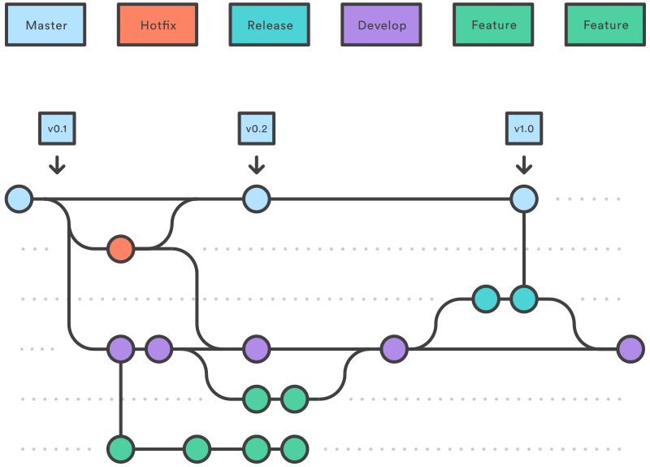

## Welcome to GitHub Pages

Hi and welcome to my GitHub Page. I'm Daniel, undergraduate Software Engineering student. 
Here you can check my recent developments and stuff that I've been working on.

## [Be The Hero](https://github.com/danielcstock/be-the-hero)
Be the Hero is a mobile app developed in the 11th OmniStack week sponsored by [Rocketseat](https://rocketseat.com.br/).

## GitFlow
Essa semana decidi me aventurar entre as ferramentas do GitHub e sair do automático na utilização do repositório. Comecei um projeto [novo](https://github.com/danielcstock/partilha_app) com o auxílio do GitFlow. É claro que antes de apostar nesse modelo de repositório eu chequei todas as vantagens e facilidades que o GitFlow oferece a uma equipe de desenvolvimento.
Começando da sua origem, o modelo do GitFlow foi idealizado por [Vincent Driessen](https://nvie.com/about/) para gerenciamento de projetos de grande porte com foco em prazos de entrega e, basicamente, define funções às branches do repositório.
Para inicializar o repositório, ao invés do conhecido **git init**, usaremos o comando:

    git flow init
	    
O GitFlow se encarrega de inicializar o repositório com duas branches principais: **master** e **develop**.
* master: mantém a versão oficial das _releases_.
* develop: branch destinada ao desenvolvimento de novas funcionalidades (_features_).

No GitFlow, cada feature deve ter sua própria branch, mas ao invés de serem mescladas com a master, devem ser mescladas com a develop. O modelo do repositório se encarrega de mesclar corretamente as features, você só precisa utilizar os comandos corretos.
Para criar uma feature use o comando:

    git flow feature start feature_name
        
Após o desenvolvimento da funcionalidade, chamamos o comando abaixo para mesclá-la a develop:

    git flow feature finish feature_name
    
Toda vez que uma versão do sistema estiver pronta para um release é feito um branch release com:

    git flow release start 0.1.0
    
Sempre que um release é validado, deve-se mesclar o release com a master e a develop. O GitFlow ajuda nessa etapa fornecendo um único comando para a atualização das branchs:

    git flow release finish '0.1.0'
    
Para finalizar esse tour pelo GitFlow temos as **hotfix branches**, destinadas aos indesejados, porém familiares bugs. Para abrir uma hotfix branch use o comando:

    git flow hotfix start hotfix_name
    
Esse tipo de branch é baseada na master, logo sempre que concluídas devem ser mescladas com a master e a develop, assim como as releases. Para finalizar uma hotfix branch e atualizar o código nas branches principais use:

    git flow hotfix finish hotfix_name
    
A figura abaixo ilustra o funcionamento do GitFlow.

Fonte: https://www.atlassian.com/git/tutorials/comparing-workflows/gitflow-workflow
    
